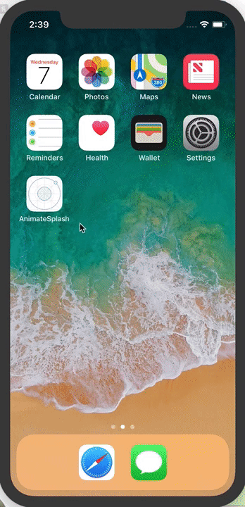

# Animated Splash for Mobile Apps

Turns out you can now use After Affects animations on the web. 



This is a lot of fun and has lots of potential.


### Installing

You will need NPM and Ionic.

Download the repo

```
git clone https://github.com/yannbf/ionic-lottie.git
cd ionic-lottie
```

And install

```
npm i
ionic serve
```

The animation is inside assets/animations/splash.

## Built With

* [After Affects](https://www.adobe.com/products/aftereffects.html) - For creating the animation
* [Bodymovin](https://aescripts.com/bodymovin/) - To export the animation
* [ng-lottie](https://github.com/chenqingspring/ng-lottie) - To display the animations
* [Ionic 3](https://ionicframework.com/framework) - For mobile

## Releases

There are 2 releases in this project. The fist is just an animated splash using regular CSS animations. The second one uses lottie to display the after affects animation.

## Authors

* **Brent Daugherty** - [doorty](https://github.com/doorty)

You can find him online: [@brentd49](http://doorty.com).

## License

This project is free :)

## Acknowledgments

* The [first guy](https://github.com/yannbf/ionic-lottie) that used Lottie with Ionic
